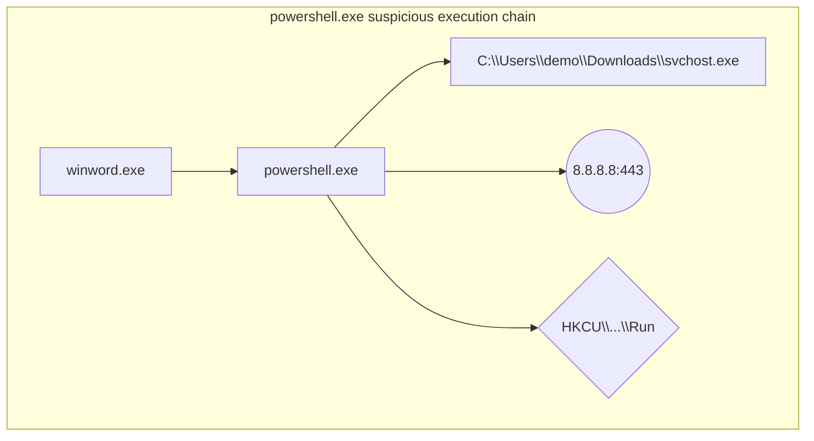

# Sample Output Fragments

## JSONL Event

```json
{
  "event_id": "8b5b5d08-520e-4c6d-8b7a-e6c9f6c670f8",
  "ts_wall": "2026-03-24T09:00:12Z",
  "ts_mono": 4211,
  "source": "network_poller",
  "event_type": "net_connect",
  "entity_key": "windows:8424:1774333201000",
  "parent_entity_key": "windows:4180:1774333189000",
  "severity": "medium",
  "fields": {
    "local_addr": "10.0.0.5:51422",
    "protocol": "tcp",
    "remote_addr": "8.8.8.8:443",
    "state": "established"
  },
  "raw_ref": "events.jsonl:128",
  "prev_event_hash": "bf6b75f9d2f8a7be9e948f4f45d6fc97b68783a540d72e25f161a94f5b6d85c2",
  "event_hash": "f48c45ca581f42ba3b2a2c87934e61630222a7a6387c337ab17f4f44234a1a9d"
}
```

## Mermaid Chain



## Rule Hit

```json
{
  "rule_id": "TG-R003",
  "entity_key": "windows:8424:1774333201000",
  "severity": "high",
  "why_matched": "network-active child is descended from winword.exe via script host powershell.exe",
  "evidence_refs": [
    "40baf6c7-df42-4237-bbc8-7063ccac8d77",
    "0de2a69a-f887-4a93-9053-4450c73508cb"
  ]
}
```

